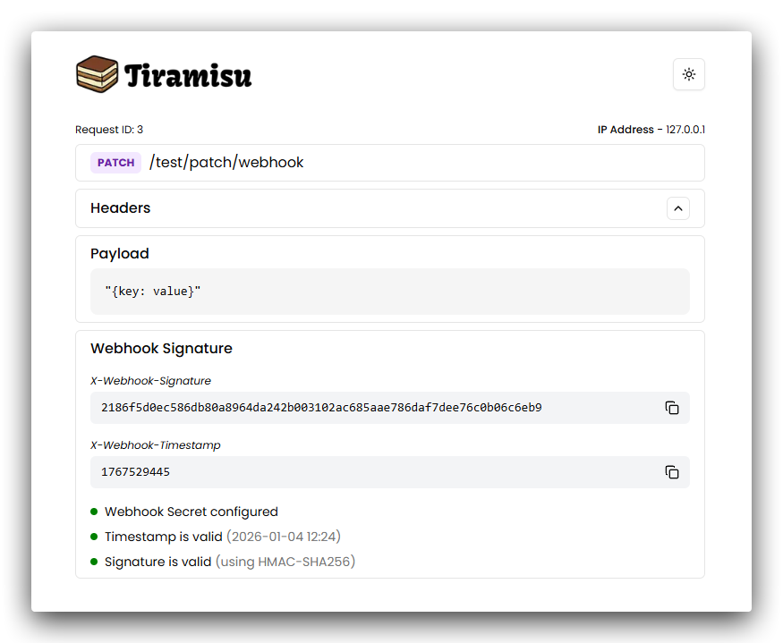

<div align="center">
  
  
</div>

Tiramisu is a simple, open-source, and lightweight HTTP request inspector. Perfect for testing webhooks, APIs, and integrations with ease.

<div align="center">
    
</div>

## Running with Docker

Checkout the Docker image [here](https://hub.docker.com/r/geloop/tiramisu)

`docker-compose.yaml`

```bash
services:
  tiramisu:
    image: geloop/tiramisu:latest
    ports:
      - "3000:3000"
    environment:
      - WEBHOOK_SECRET=<webhook-secret> [OPTIONAL]
      - SIGNATURE_HEADER=<signature-header> (e.g X-Signature) [OPTIONAL]
      - TIMESTAMP_HEADER=<timestamp-header> (e.g X-Timestamp) [OPTIONAL]
    volumes:
      - tiramisu-data:/app/data

volumes:
  tiramisu-data:
```

Start **Tiramisu**:

```bash
docker-compose up
```

## Webhook Testing

Tiramisu offers webhook signature validation, allowing you to verify the authenticity of incoming requests.

Set up the following environment variables:

- `WEBHOOK_SECRET`: The secret key used to sign your webhook requests.
- `SIGNATURE_HEADER`: The header key used to store the signature in the request.
- `TIMESTAMP_HEADER`: The header key used to store the timestamp in the request.

#### Validation Process

The expected signature format is: `{timestamp}.{payload}`.

Tiramisu uses the SHA256 algorithm to generate generate the signature and validate the received signature from the `SIGNATURE_HEADER` in.

Additionally, any out-of-date requests will be labelled as invalid using the `TIMESTAMP_HEADER` header.

## Tech Stack


